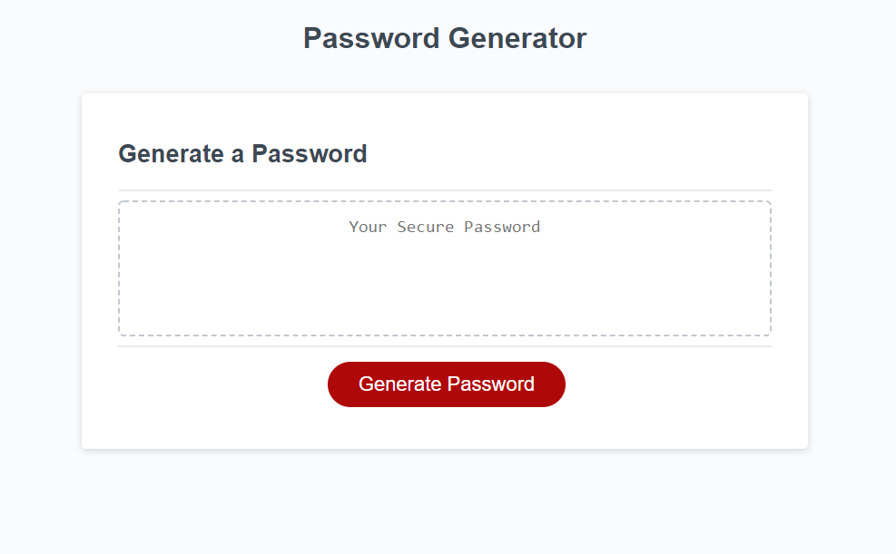
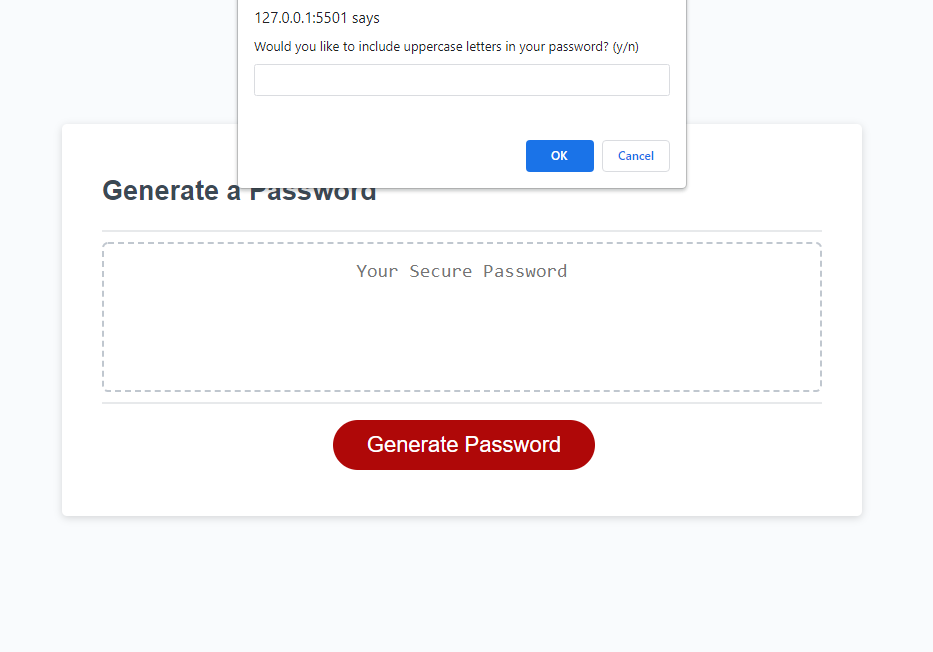
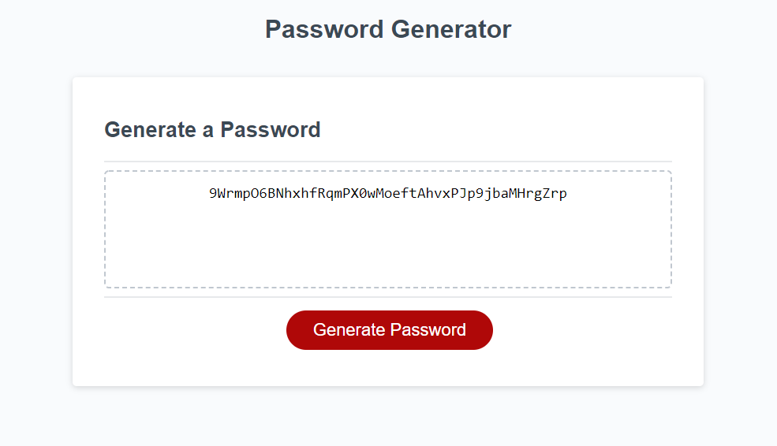

# Challenge-3-Ishan-Wijesingha

## Link to deployed application
https://ishan-wijesingha99.github.io/Random-Password-Generator/

## Description
This application generates a random password for a user. Once a user clicks the 'generate password' button, a series of prompts appear sequentially in the browser window. Based off the answer the user gives to these prompts, a random password is generated. Through these prompts, the user can choose how many characters are included in this password, if it includes lowercase letters, uppercase letters, numbers and/or symbols. Once the password is generated, it will then be displayed on the webpage

## Screenshot of application

